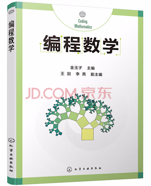
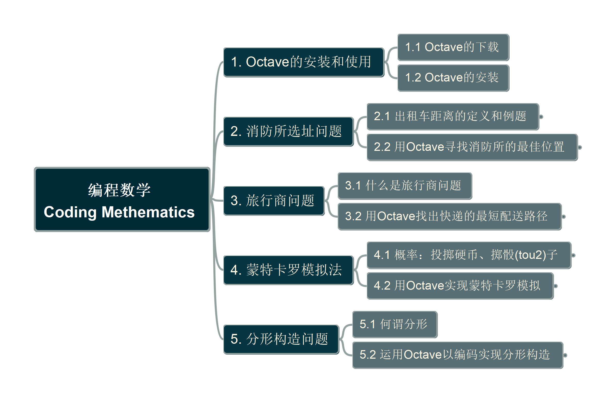

# Coding Mathematics 《编程数学》

作者： 金玉子

Learning by Practicing on Octave

The book can be purchased at jd.com: https://item.jd.com/12724025.html, or read in 微信读书

## Book Structure 内容结构

## Step by Step Learning Video

[Link in My YouTube Channel](https://www.youtube.com/playlist?list=PL6DEHvciXKeW7wVsceucyZTEK6-_CjPFq), speaking in Chinese Mandarin

---

Welcome to leave comments to my videos or drop me [email here](mailto:xiaoqizhao@outlook.com). And, thanks for supporting with your sponsor!