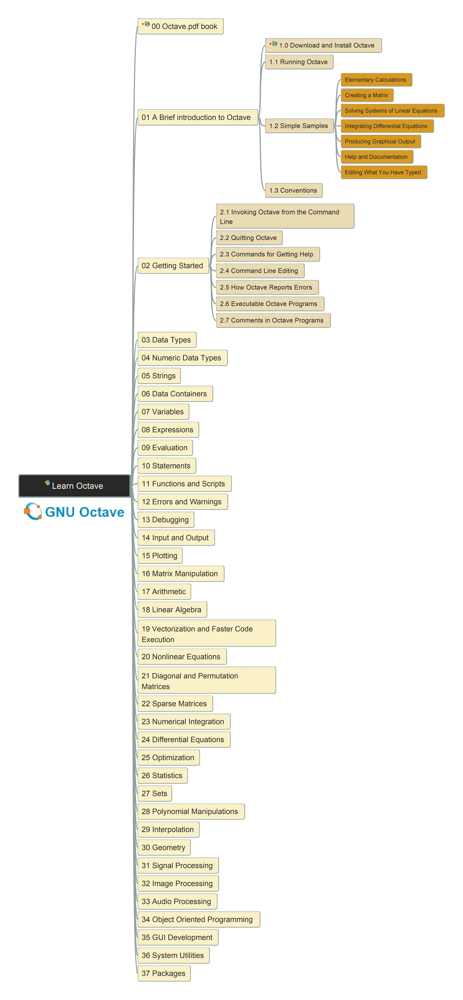

# Octave - Learn by Practicing

is one opensource scientific programming language for numerical computations.

## About this Repository

This repository records my learning of [Octave](https://octave.org/#) and shares the practical experience during learning.

The repository is regularly synced to Gitee:

- Link of Repository in Github: https://github.com/yasenstar/learn_octave
- Link of Repository in Gitee: https://gitee.com/yasenstar/learn_octave

The version of Octave used in version 8.3.0.

---

## Reference Documents

| Reference Document | Link in Octave Site | Local link in This Repo |
| --- | --- | --- |
| GNU Octave Manual (v8.3.0) | [link](https://docs.octave.org/octave-8.3.0.pdf) | [local link](/reference/octave_8-3-0.pdf) |
| Octave Quick Reference | [link](https://docs.octave.org/quickref.pdf) | [local link](/reference/quickref.pdf) |
| Octave Reference Card | [link](https://docs.octave.org/refcard.pdf) | [local link](/reference/refcard.pdf) |

---

## Tutorial Videos

Here is the [video list in my YouTube Channel](https://www.youtube.com/playlist?list=PL6DEHvciXKeUho-j-75rbFs6TBxG7KOPg).

You can go to specific videos from below links directly (keep updating):

| Video Title | Link in YouTube | Link in bilibili |
| --- | --- | --- |
| 001 Opening and Installation | TBA | [link](https://www.bilibili.com/video/BV1LN41137jJ/) |
| 002 Simple Examples | TBA | [link](https://www.bilibili.com/video/BV1Dz4y1P77z/) |

---

Some other similar tools like Octave which are treated also as Matlab's open source alternatives:

- [Julia](http://julialang.org/): a dynamically typed programming language featuring Lisp-style macros, built-in primitives for parallel computing, and functions designed for matrix manipulation, data visualization, and more
- [NumPy](http://www.numpy.org/): the main package for scientific compting with Python, which can process N-dimensional arrays, complex matrix transforms, linear algebra, Fourier transforms, and can act as gateway for C and C++ integration.
- [Scilab](http://www.scilab.org/): another open source option for numerical computing that runs across all the major platforms.
- [SageMath](http://www.sagemath.org/index.html): another open source mathematics software system that might be a good option for those seeking a MATLAB alternative, it's built on top of a variety of well-known Python-based scientific computing libraries, and its own language is syntactically similar to Python.

---

Feel free to raise any questions in comments, or [email here](mailto:xiaoqizhao@outlook.com), I'll try my best to answer!

---

Here is the image export of the learning mindmap (keep updating), you may use this [source mindmap](/learn_octave.mm) to navigate in the knowledge to learn:

