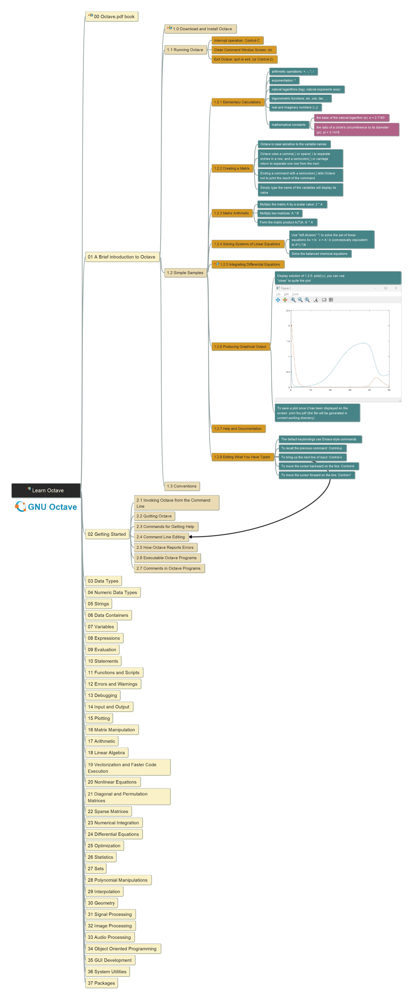

# Octave - Learn by Practicing

is one opensource scientific programming language for numerical computations.

This repository records my learning of [Octave](https://octave.org/#) and shares the practical experience during learning.

The version of Octave used in version 8.3.0.

| Reference Document | Link in Octave Site | Local link in This Repo |
| --- | --- | --- |
| GNU Octave Manual (v8.3.0) | [link](https://docs.octave.org/octave-8.3.0.pdf) | [local link](/reference/octave_8-3-0.pdf) |
| Octave Quick Reference | [link](https://docs.octave.org/quickref.pdf) | [local link](/reference/quickref.pdf) |
| Octave Reference Card | [link](https://docs.octave.org/refcard.pdf) | [local link](/reference/refcard.pdf) |

Here is the [video list in my YouTube Channel](https://www.youtube.com/playlist?list=PL6DEHvciXKeUho-j-75rbFs6TBxG7KOPg).

Here is the image export of the learning mindmap (keep updating):

Feel free to raise any questions in comments, or [email here](mailto:xiaoqizhao@outlook.com), I'll try my best to answer!